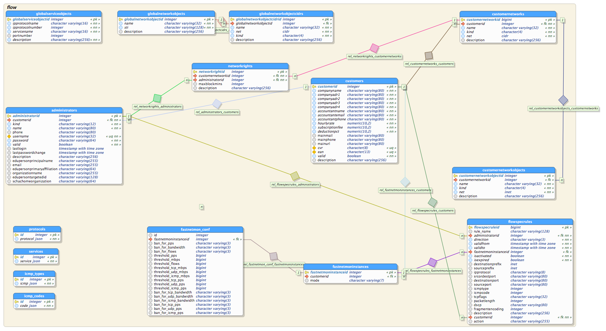

<!-- $theme: gaia -->

# DeIC DPS: short system design description

This is a short system design description that places the database server in the context of the DDoS mitigation service.

This document describes the finished version 1.0 system.

## Workflow

DDoS mitigation based on BGP flowspec requires some rules to _enter_ the
system, and other rules to be _sent to and enforced by peering partners and upstream providers_.
The following drawing illustrates the different components: on the left we can
see a customer site where a detection engine (here FastNetMon) monitors traffic
to a group of networks and logs traffic statistics in a local influx database.       

When an attack is detected a set of mitigation rules are generated by FastNetMon and sent to
DDPS via an encrypted channel. The rules are added to a database and announced
as flowspec rules and sent upstream and to edge. The rules are enforced on
edge on the routers thereby mitigating the attack. Rules are later withdrawn.

<!-- the image is made in Draw.io (chrome app), the src is in media/docs/workflow.xml -->

The rules have to match the BGP community we are responsible for: they have to match
our network only. The system has been designed in this way from the entrance point
to the exit point: customers can only create rules affecting their own network which is
a subset of ours, and the system can only send rules upstream which matches our
network as such.

Rules are made up of the 12 fields defined in
[RFC5575](https://tools.ietf.org/html/rfc5575) and
[RFC7674](https://tools.ietf.org/html/rfc7674) with a start and expire time
together with some customer information.

Rules are added to the system from two sources:

  - a *policy editor* operated by the customer (Web-UI and command line)
  - an *automatic detection engine* based on
    [fastnetmon](https://github.com/pavel-odintsov/fastnetmon)

Rules are uploaded to the database server and added to a
[postgres](https://www.postgresql.org) database. A daemon queries the database
for new and expired rules. The daemon converts the rules to BGP flowspec
announces and withdraw rules and inserts them in two
[exabgp](https://github.com/Exa-Networks/exabgp) instances from where they are
sent to our edge routeres, peers and upstream provider.

Database schema

## Design

The drawing does not show everything for version 1.0

  - the system is protected by a firewall / VPN gateway, and customers must
    exist in [WAYF](https://www.wayf.dk/en/about-wayf/faq), be in a local database and
    has the right VPN credentials
  - the database is replicated
  - there is a customer and system wide _kill switch_ to withdraw some or all rules
  - there is a 24 x 7 network operator backup behind the system in case of failure
  - every component is attempted to be designed and implemented
    [fail safe](https://en.wikipedia.org/wiki/Fail-safe)

## Critic of existing systems

We evaluated [firewall on demand](https://flowspy.readthedocs.io/en/latest/) made by
[grnet.gr](https://grnet.gr/en/) and found it had some disadvantages compared to
what we wanted. Among others they included

  - configuration based on netconf (see [RFC4741](http://www.rfc-editor.org/rfc/rfc4741.txt),
	[netconf docs](http://www.netconfcentral.org/netconf_docs)) and
	[RFC4742](https://tools.ietf.org/html/rfc4742) Using the NETCONF Configuration
	Protocol over Secure SHell).  All announce and withdraw would would either
	be batched or require a full router configuration to be installed in the
	first router. Implementing a kill switch would also be more complex than
	e.g. using [exabgp](https://github.com/Exa-Networks/exabgp) and just restart
	the service.
  - The code requires [shibboleth](https://shibboleth.net) for authentication while
    we would use [WAYF — the digital recycling centre](http://wayf.dk)
  - At the time we started the project was no longer maintained. The project
    has a long list of dependencies and we could choose between
	- take on the maintenance of the code base ourself, using time trying to understand
	  the code while fixing errors and tailoring it to suit our requirements
	- freeze the code base and the dependencies and just use it as it is

Firewall on demand is a GUI which does not do any detection it self; what to
mitigate against is left to the operator.

We wanted a high degree of automatic mitigation, as time is critical and a
spare resource during a DDoS attack. The need for manual rules would be to
mitigate events in the future which may be likely to be attacked, e.g. national
tests and on-line examines. That would require a GUI and we would like to
integrate it with other information (network status stored in influxdb etc.).
Finally we would like the database to be customer centric: administrators,
network, fastnetmon configuration etc. should go there to simplify deployment.

## A simpler solution

We might get along with a much static simpler solution, where only the top
volumetric attack vectors from e.g [Akamai's
report](https://www.akamai.com/us/en/multimedia/documents/state-of-the-internet/q4-2016-state-of-the-internet-security-report.pdf)
is banned from the edge routers as suggested in [BPCP](http://nabcop.org/index.php/DDoS-DoS-attack-BCOP)
That is done in a [42 line long shell script](ddps-src/default-rules.sh)

